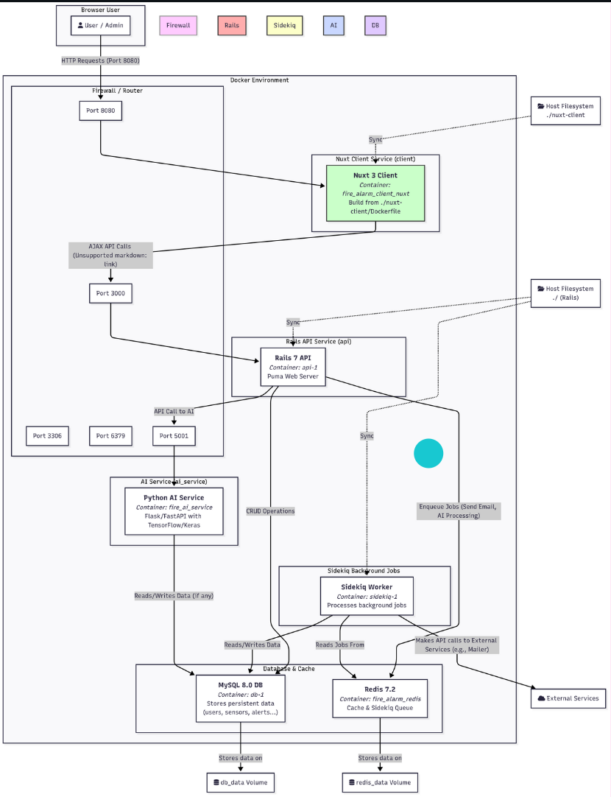
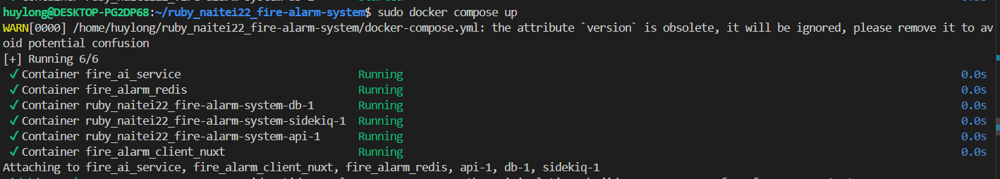

# Rails tutorial - Sample App
Hệ thống cảnh báo cháy được thiết kế với ba thành phần chính:
    - Hệ thống phát hiện cháy (AI Service):
        + Sử dụng mô hình Deep Learning đã được huấn luyện để nhận diện hình ảnh cháy từ luồng dữ liệu camera.
        + Khi phát hiện cháy, hệ thống sẽ gửi thông tin cảnh báo (bao gồm hình ảnh, thời gian, địa điểm) đến server trung gian.
    - Hệ thống server trung gian (FireWolf Server):
        + Nhận dữ liệu cảnh báo từ hệ thống AI.
        + Sử dụng WebSocket để truyền thông báo tức thời đến các client đang kết nối.
        + Quản lý các kết nối client, lưu trữ sự kiện cảnh báo nếu cần.
    - Giao diện người dùng (FireWolf Client):
        + Hiển thị cảnh báo cháy real-time cho người quản lý.
        + Cung cấp các chức năng như xem lịch sử cảnh báo, xác nhận và xử lý các sự cố.

# 1. Phiên bản cài đặt để chạy được dự án:

Yêu cầu hệ thống
- Docker
- Docker Compose
- Ruby: 3.2.2
- Rails: 7.0.7
- MySQL

# 2. Hướng dẫn cài dự án:

Sử dụng Docker (Khuyên dùng)
Đây là phương pháp được đề xuất vì nó tự động hóa toàn bộ việc cài đặt môi trường và đảm bảo tính nhất quán trên mọi máy tính.

1. Sao chép (Clone) mã nguồn:

git clone https://github.com/awesome-academy/ruby_naitei22_fire-alarm-system.git
cd ruby_naitei22_fire-alarm-system

2. Cấu hình biến môi trường:
Tạo một file .env từ file mẫu .env.example. File này sẽ chứa các mật khẩu và thông tin nhạy cảm.

cp .env.example .env

Sau đó, mở file .env và điền các giá trị mật khẩu bạn muốn.

3. Build và khởi chạy các container:
Lệnh này sẽ tự động build các image cần thiết và khởi chạy toàn bộ hệ thống (web, database, redis, sidekiq,...) ở chế độ nền.

sudo docker compose up --build -d

4. Chuẩn bị cơ sở dữ liệu:
Chạy các lệnh sau để tạo và migrate database. Các lệnh này được thực thi bên trong container api.

# Tạo database
sudo docker compose exec api rails db:create

# Chạy migrate
sudo docker compose exec api rails db:migrate

## 2.1 Cài đặt config(chỉ chạy lần đầu)
- Tạo config database cho dự án: cp config/database.yml.example config/database.yml
- Chạy lệnh để tạo database: rails db:create
- Bật server: rails s
Truy cập đường dẫn http://localhost:3000/ hiển thị Rails là thành công

